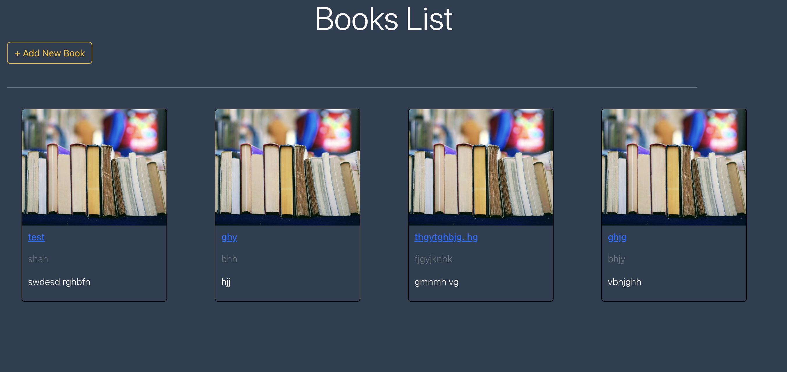

# MERN Booklist

A full-stack booklist application built with the MERN stack (MongoDB, Express.js, React, Node.js).

## Features

- Add, edit, and delete books
- View a list of all books
- Responsive user interface
- RESTful API backend
- CI/CD pipeline 

## Technologies Used

- MongoDB
- Express.js
- React
- Node.js

## Getting Started

1. **Clone the repository:**
    ```bash
    git clone https://github.com/yourusername/mern-booklist.git
    cd mern-booklist
    ```

2. **Install dependencies:**
    ```bash
    cd backend
    npm install
    cd ..
    cd client
    npm install
    ```

3. **Start the backend server:**
    ```bash
    npm run backend-serve
    ```

4. **Start the frontend React app:**
    ```bash
    npm run frontend-dev
    ```

## Folder Structure

- `/client` - React frontend
- `/server` - Express backend

## License

This project is licensed under the MIT License.

    
    
